# UI Design Document Perigo
##### Created by: Andrew Hariri 11/1/2018


## Table of Contents
-   [Design Guideleines](#dg)
    -   [Styles](#styles)
        -   [Colors](#colors)
        -   [Fonts](#fonts)
        -   [Icons](#icons)
        -   [Sizing](#sizing)
    -   [Page Layout](#pageLayout)
        -   [HTML BoilerPlate](#htmlFormat)
-   [Pages](#pages)
    -   [Home](#home)
    -   [Product](#product)
    -   [Account](#account)


## Design Guidelines

### Styles


#### Colors

###### Rose Quartz
 `#F8CBCA`

###### Serenity Blue
 `#92A8D1`

###### Default Text Color
 `#494949`

###### Light Gray for Filler text
 `#D9D9D9`

###### Gray button border
 `#979797`


#### Fonts
<h1 style="font-family: Avenir Next;">H1 Avenir Next</h1>
<h2 style="font-family: Avenir Next;">H2 Avenir Next</h2>
<h3 style="font-family: Avenir Next;">H3 Avenir Next</h3>
<h4 style="font-family: Avenir Next;">H4 Avenir Next</h4>
<h5 style="font-family: Avenir Next;">H5 Avenir Next</h5>
<p style="font-family: Avenir Next;">P Avenir Next</p>

```css
/* FONTS FOUND IN GITHUB REPO */
@font-face {
  font-family: 'Avenir Next';
  src: url("./fonts/AvenirNext-Regular.ttf");
  font-weight: normal;
}

@font-face {
  font-family: 'Avenir Next';
  src: url("./fonts/AvenirNext-Medium.ttf");
  font-weight: 200;
}

@font-face {
  font-family: 'Avenir Next';
  src: url("./fonts/AvenirNext-Bold.ttf");
  font-weight: bold;
}

@font-face {
  font-family: 'Avenir Next Italic';
  src: url("./fonts/AvenirNext-UltraLightItalic.ttf");
  font-weight: lighter;
}

@font-face {
  font-family: 'Avenir Next Italic';
  src: url("./fonts/AvenirNext-Italic.ttf");
  font-weight: normal;
  font-style : normal;
}

@font-face {
  font-family: 'Avenir Next Italic';
  src: url("./fonts/AvenirNext-MediumItalic.ttf");
  font-weight: 200;
}

@font-face {
  font-family: 'Avenir Next Italic';
  src: url("./fonts/AvenirNext-BoldItalic.ttf");
  font-weight: bold;
}
```


#### Icons

###### Down Arrow


###### Keyword


###### perigoIcon


###### Rating
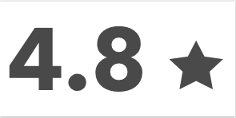


###### SavedPlus1
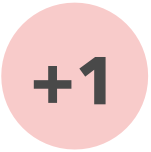


###### sendMessage


###### upload
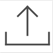


#### Sizing
###### Saved Items Tab
-   width: 400px
-   position: fixed

###### Body
-   width: 100%
-   height: 100%

###### outerContainer
-   max-width: 1500px


###### header
-


### Page Layout

This is an idea of how the product page should be setup. Use flexbox in your CSS to organize the divs on the page and checkout <https://css-tricks.com/snippets/css/a-guide-to-flexbox/> for a guide on how to use flexbox.

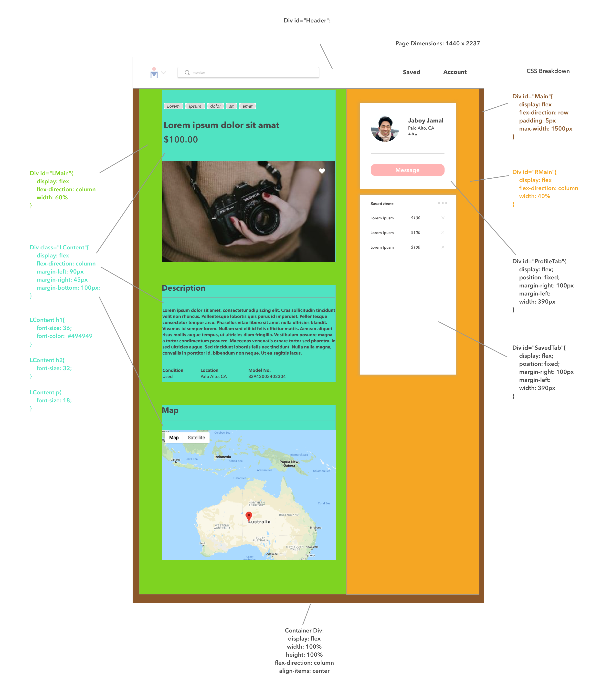


#### HTML BoilerPlate
```html
<body>
    <div id="outerContainer">
        <div class="header">
            <div id="icon"></div>
            <div id="search-bar">
                <input type="text" id="search" name="search" placeholder="Search...">
            </div>
            <div class="header-frame">
                <div id="saved-text"class="header-text" onClick="showSavedItems()">Saved</div>
                <div class="header-text">
                    <div id="sign-In-text" class="g-signin2" data-onsuccess="onSignIn">Sign In</div>
                </div>
            </div>
        </div>
        <div class="main">
            <div class="main-frame">
                <div class="browser-bar">
                    <div class="browser-text">
                        <div class="title-text">Browse</div>
                    </div>
                </div>
                <div class="inner-frame">
                    <div class="item-frame">
                    </div>
                    <div class="saved-items" id="saved-items">
                        <div class="saved-title">Saved Items</div>
                        <hr style="background-color: #E5E5E5; margin-bottom: 0px"/>
                        <table id="saved-table">
                            <tr>
                                <td><div class="table-item-text" data-itemID="1" onClick="getItem(this)">Lorem Ipsum</div></td>
                                <td><div class="table-price-text">$100</div></td>
                                <td><i class="fas fa-times" style="color: #949494;" data-itemID="1" onClick="unsaveItem(this)"></i></td>
                            </tr>
                            <tr>
                                <td><div class="table-item-text" data-itemID="2" onClick="getItem(this)">Lorem Ipsum</div></td>
                                <td><div class="table-price-text">$100</div></td>
                                <td><i class="fas fa-times" style="color: #949494;" data-itemID="2" onClick="unsaveItem(this)"></i></td>
                            </tr>
                            <tr>
                                <td><div class="table-item-text" data-itemID="3" onClick="getItem(this)">Lorem Ipsum</div></td>
                                <td><div class="table-price-text">$100</div></td>
                                <td><i class="fas fa-times" style="color: #949494;" data-itemID="3" onClick="unsaveItem(this)"></i></td>
                            </tr>
                        </table>
                    </div>
                </div>
            </div>
        </div>
    </div>
</body>
```

#### CSS BoilerPlate
look at style.css page


## Pages
Important things to consider about the pages:
1. No more Messages Tab
2. Sign In turns from Sign In to Account when user Signs in
3. You must Sign In to save Items (ie. when you click the heart on tile). Check the browse page with the popup to see how it behaves when a user tries to save an item and the user hasn't logged in.
4. The Saved Tab pops out when you click on it

### Home


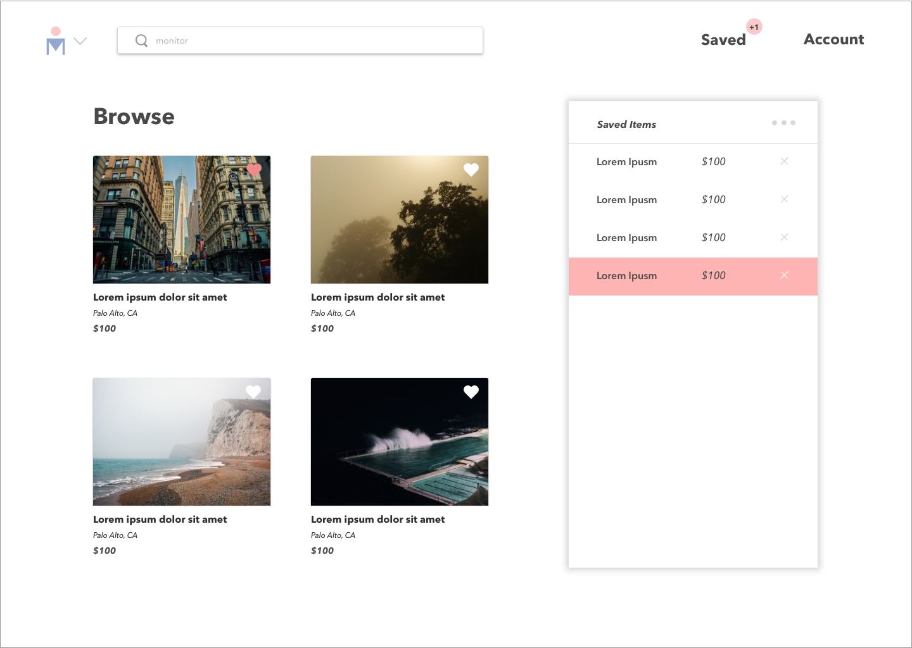


### Product
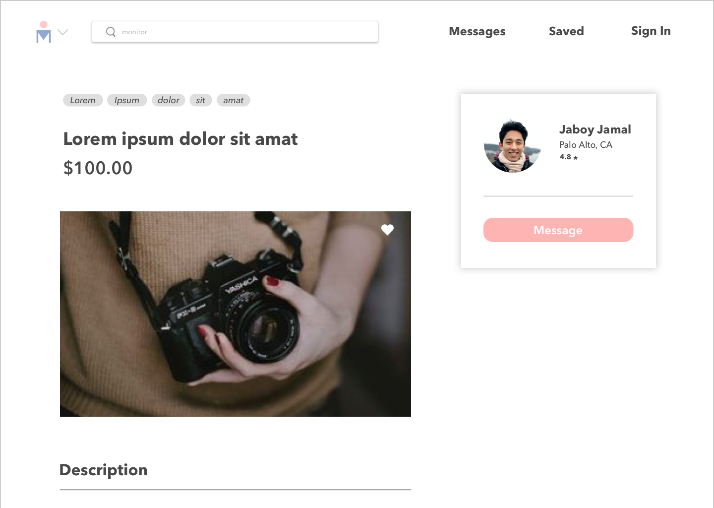
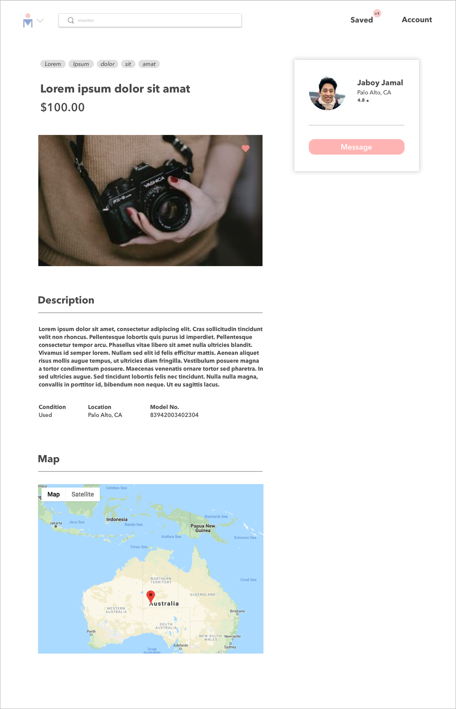


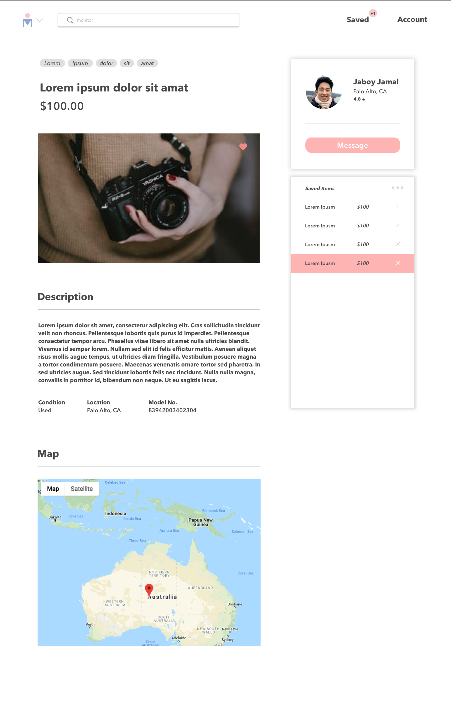
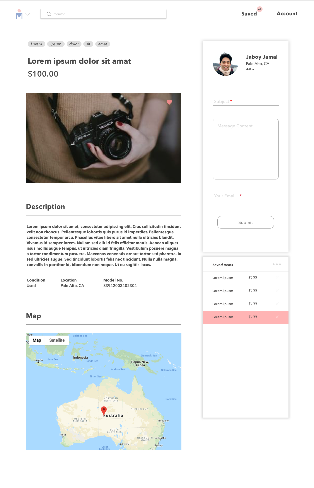
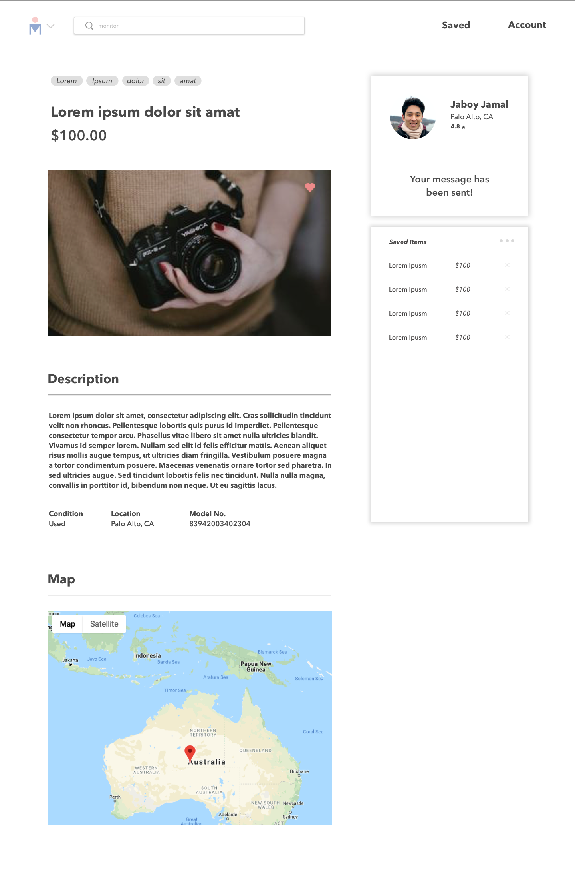
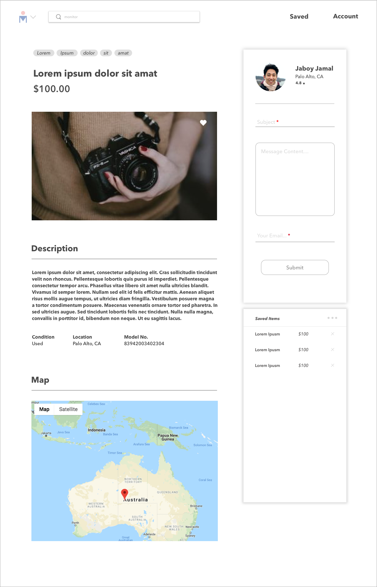


### Account

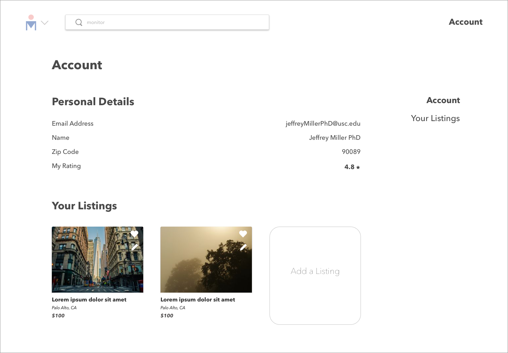
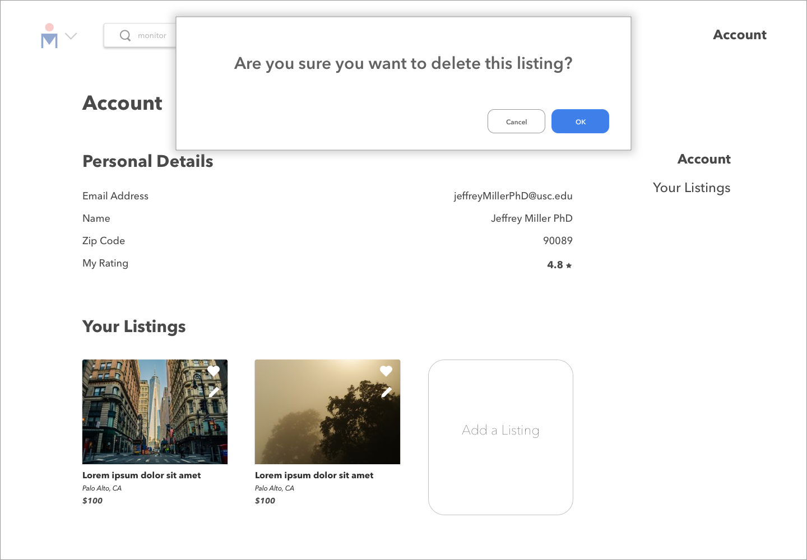
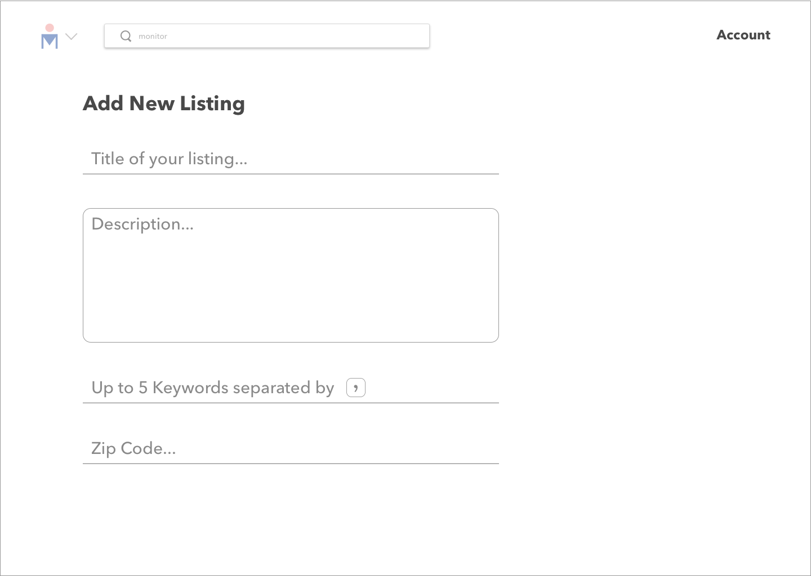
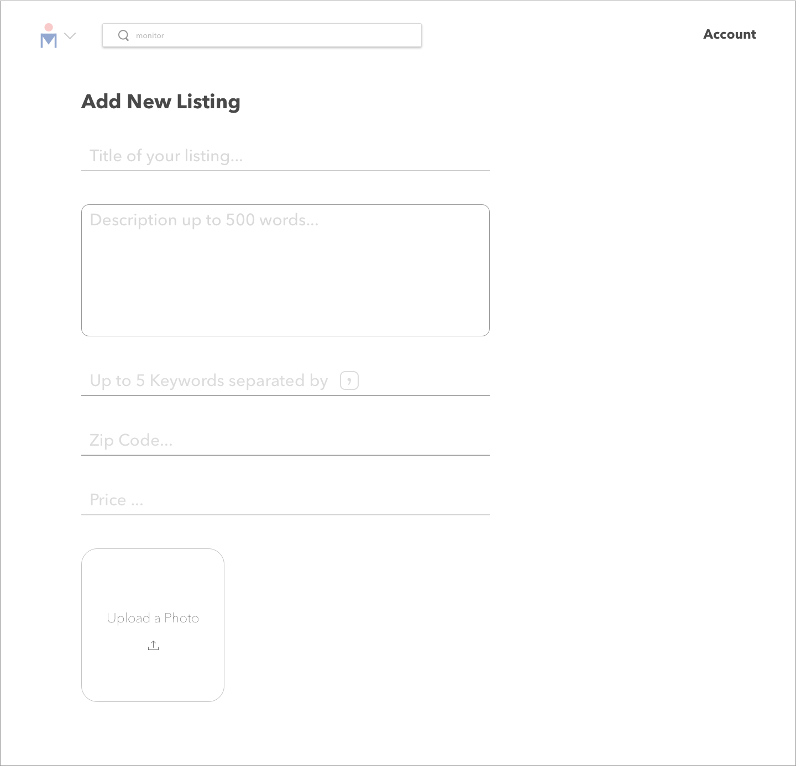
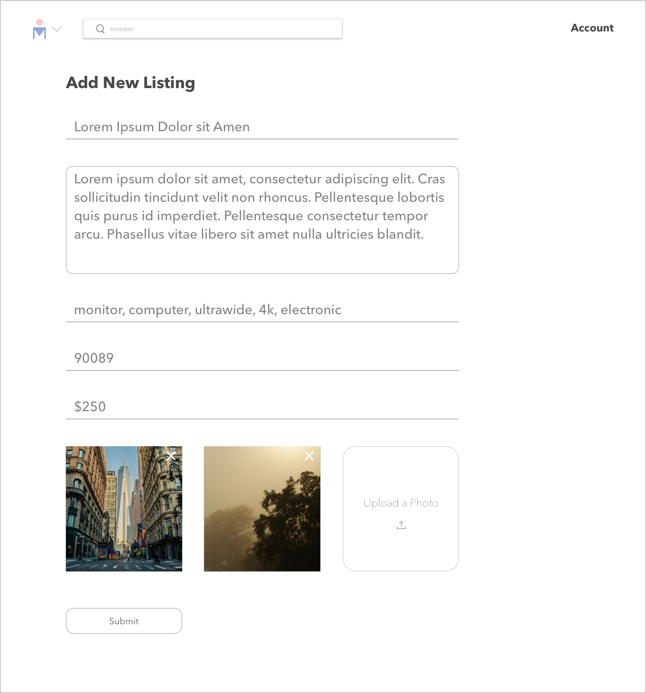
